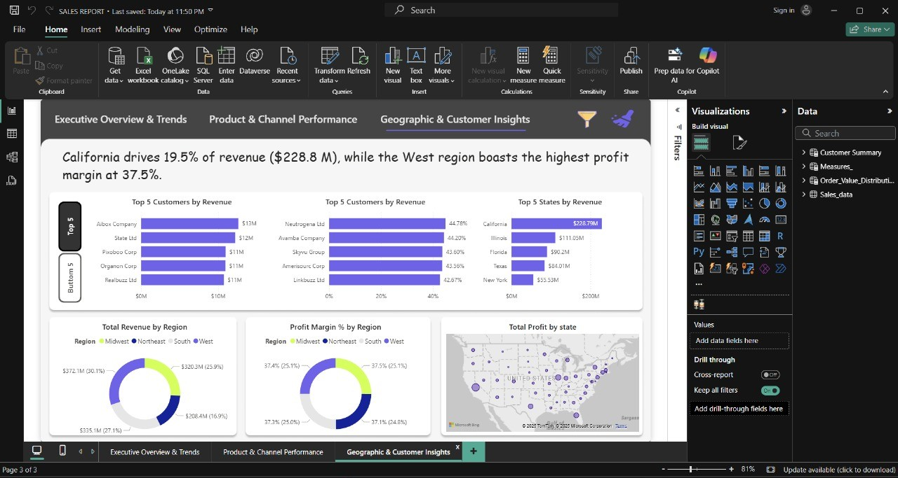

# 📊 End-to-End Sales Analysis

> 🔍 **To explore the analysis, open the .pbix file in Power BI Desktop and the .xlsx or .csv file in Excel or any spreadsheet tool.**

---

## 🗂 Repository Overview

This repository presents an end-to-end data analysis project focused on uncovering business insights from public sales data. Using Power BI and supporting tools, the project covers everything from raw data to impactful visual dashboards.

---

## 📌 Project Description

This project explores and visualizes sales data to identify:
- Revenue growth patterns
- Customer spending tiers
- Channel and regional performance

### Key Highlights:
- Designed an Entity-Relationship Diagram (ERD) to map table relationships
- Performed data cleaning and transformation in Power BI
- Developed interactive dashboards for executive-level decision-making

---

## 🧰 Tools & Technologies Used

- *Power BI* – For data visualization and dashboard creation  
- *Microsoft Excel / CSV* – For raw data input and preprocessing  
- *DAX* – For calculated fields, KPIs, and custom logic  

---

## 📊 Dashboard Snapshots

### 1. Executive Overview & Trends
> Overall performance metrics such as Total Revenue, Profit Margin, Orders, and monthly trends.


---

### 2. Product & Channel Performance
> Top-selling and high-margin products, profitability by channel, and strategic product positioning.


---

### 3. Geographic & Customer Insights
> Regional performance, customer segmentation, and state-level profit insights.



---

## 🚀 How to Use This Repository

To get started with the project:

1. *Clone or Download* the repository:
   ```bash
   git clone https://github.com/your-username/End-to-End-Sales-Analysis.git
